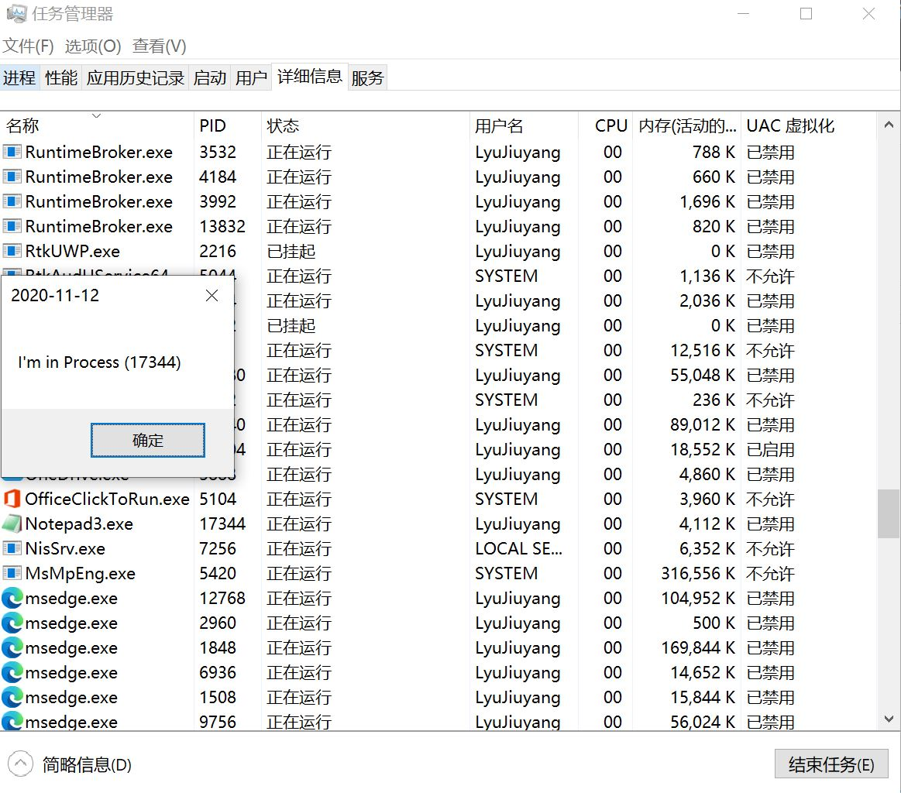
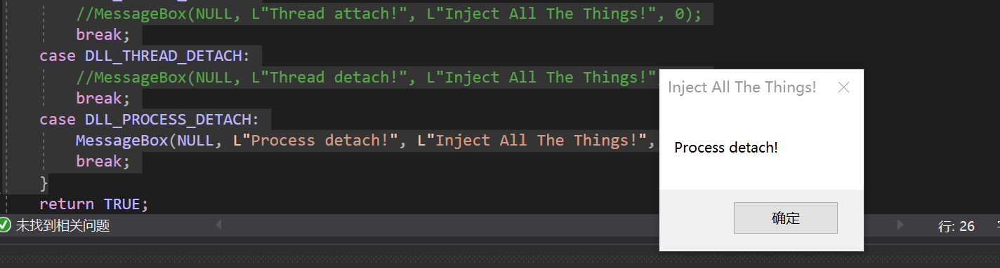

# Dll Injection

## 实验要求

- 参考[示例代码](https://github.com/fdiskyou/injectAllTheThings)，编写一个dll文件，并能在exe中成功调用（第一步不需要实现远程线程注入）。

- 使用injectAllTheThings给出的方法注入notepad.exe。


## 实验代码

本次实验代码删除.sdf文件后上传至[dllInjection](https://github.com/LyuLumos/Reverse-Engineering-and-Software-Security/tree/master/dllInjection)

## 实验一流程
1. 下载[示例代码](https://github.com/fdiskyou/injectAllTheThings)，在原解决方案下新建myDll项目，设置其属性生成dll，新建项目Project1，用于调用dll。
2. 仿照dllpoc，在myDll/main.cpp中写入代码。编译生成myDLL.dll。
    ```cpp
    #include <windows.h>
    #include <stdio.h>

    BOOL APIENTRY DllMain(HMODULE hModule, DWORD  ul_reason_for_call, LPVOID lpReserved)
    {
        switch (ul_reason_for_call)
        {
        case DLL_PROCESS_ATTACH:
            break;
        case DLL_PROCESS_DETACH:
            break;
        case DLL_THREAD_ATTACH:
            break;
        case DLL_THREAD_DETACH:
            break;
        }
        return TRUE;
    }

    //extern "C" __declspec(dllexport) int poc(int code, WPARAM wParam, LPARAM lParam) {
    extern "C" __declspec(dllexport) BOOL cuc() {
        MessageBox(NULL, L"CUC called!", L"Inject All The Things!", 0);

        TCHAR szExePath[MAX_PATH], szInfo[MAX_PATH + 100];
        GetModuleFileName(NULL, szExePath, MAX_PATH);

        printf("I'm in Process (%d), path is ", GetCurrentProcessId());
    #ifdef UNICODE
        char const* format = "%ls";
    #else 
        char const* format = "%s";
    #endif
        printf(format, szExePath);

        MessageBox(NULL, szExePath, L"Inject All The Things!", 0);

        //return(CallNextHookEx(NULL, code, wParam, lParam));
        return TRUE;
    }

    BOOL bj() {
        MessageBox(NULL, L"POC called!", L"Inject All The Things!", 0);

        //return(CallNextHookEx(NULL, code, wParam, lParam));
        return TRUE;
    }
    ```

3. 在Projet1/loader.cpp下调用生成的dll。

    ```cpp
    #include <Windows.h>
    #include <stdio.h>

    typedef BOOL(*CUC_PROC_ADDR)();

    int main() {
        HMODULE hMoudle = LoadLibraryA("myDll.dll");
        CUC_PROC_ADDR cuc_ptr = (CUC_PROC_ADDR)GetProcAddress(hMoudle, "cuc");
        void* cuc = GetProcAddress(hMoudle, "cuc");
        void* bj = GetProcAddress(hMoudle, "bj");
        printf("CUC's pos: %p, BJ's pos: %p\n", cuc, bj);
        cuc_ptr();
    }
    ```

4. 运行loader.cpp。

    成功找到cuc函数的位置，bj函数不在导出表里面，没有找到返回null。

    

    之后输出进程序号和当前进程的位置。

    

    通过查看进程管理器验证。

    

## 实验二流程
1. 将解决方案配置改成x64重新编译，因为要注入的程序是64位的。注意自己写的dll文件属性需要重新配置。
2. 在dllmain中做自己需要的更改。

```cpp
switch (ul_reason_for_call)
	{
	case DLL_PROCESS_ATTACH:

		TCHAR szInfo[MAX_PATH];
		wsprintf(szInfo, TEXT("I'm in Process (%d) "), GetCurrentProcessId());
		MessageBox(NULL, szInfo, L"2020-11-12", 0);

		break;
	case DLL_THREAD_ATTACH:
		//MessageBox(NULL, L"Thread attach!", L"Inject All The Things!", 0);
		break;
	case DLL_THREAD_DETACH:
		//MessageBox(NULL, L"Thread detach!", L"Inject All The Things!", 0);
		break;
	case DLL_PROCESS_DETACH:
		MessageBox(NULL, L"Process detach!", L"Inject All The Things!", 0);
		break;
	}
```
3. 编译完成后，打开notepad.exe（我的是notepad3），按照injectAllTheThings提供的命令注入。

```
injectAllTheThings.exe -t 1 notepad3.exe D:\GitHub\injectAllTheThings-master\x64\Release\dllmain.dll
```



关闭时显示



说明执行无误。

## 问题与解决

- TCHAR数组无论是%s，还是%ls还是直接使用cout都无法输出。
  
  字符编码的问题。程序编译为 ANSI， TCHAR 就是相当于 CHAR。
当程序编译为 UNICODE， TCHAR 就相当于 WCHAR。所以使用了ifdef判断，就可以正常输出了。

- 一直显示找不到PID

  问过老师后解决，我的电脑安装过notepad3，平常使用时直接调用notepad会打开notepad3，但是由于injectAllTheThings遍历任务管理器没有找到notepad进程，所以会报错。

## 参考

- [GitHub - injectAllTheThings](https://github.com/fdiskyou/injectAllTheThings)
- [LoadLibraryA function (libloaderapi.h)](https://docs.microsoft.com/en-us/windows/win32/api/libloaderapi/nf-libloaderapi-loadlibrarya)
