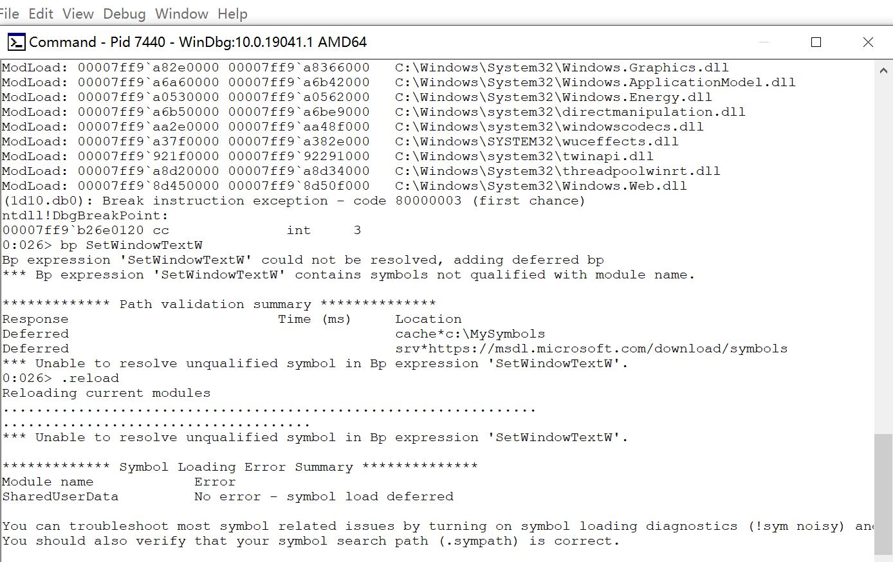
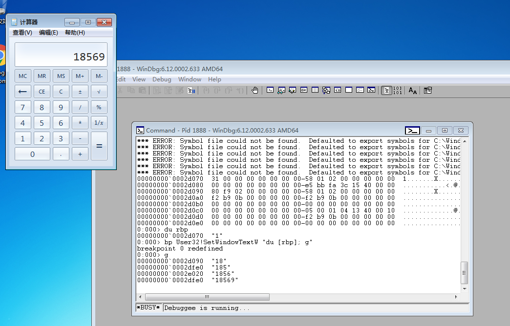
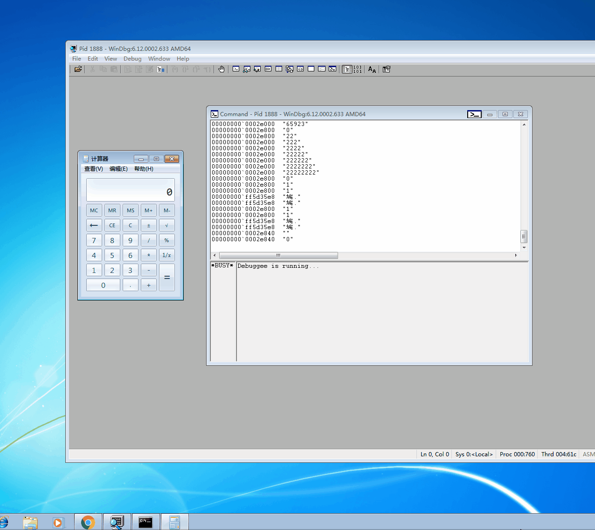

# WinDbg

## 实验要求

通过winDbg加断点的方式，调试使得计算器出现“1+1=3”的信息。

## 实验环境

- Windows7
- WinDbg x64

## 实验流程

- 尝试给SetWindowTextW函数下断点
- 更改symbol file path，重新下断点

- 增加相应的命令，查看寄存器里面的值

- 将寄存器里面的值更换，实现要求

  
## 实验遇到的问题

- win10环境下，一直报GUI的错，无法完成查看rbp的操作。
  
  更换至win7环境解决问题。

## 实验参考

- [范大的视频](http://vlab.cuc.edu.cn/student/#/course/89)

