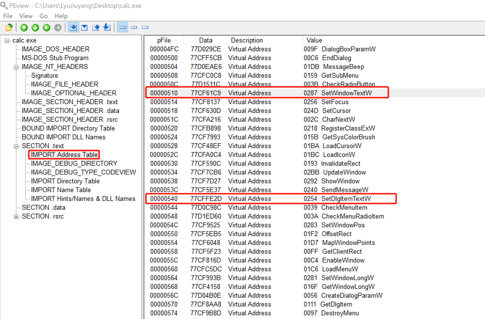
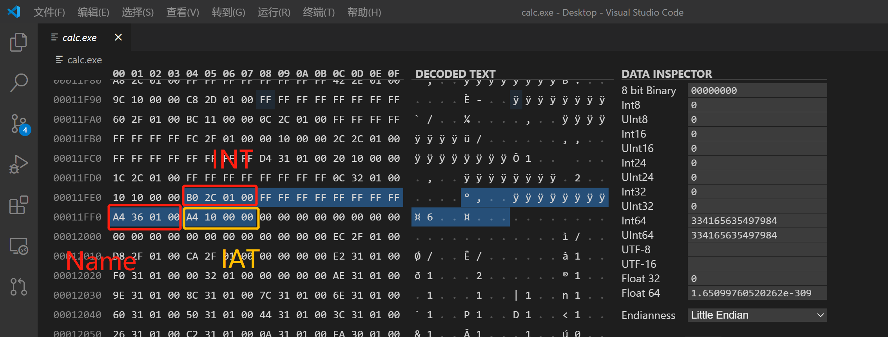
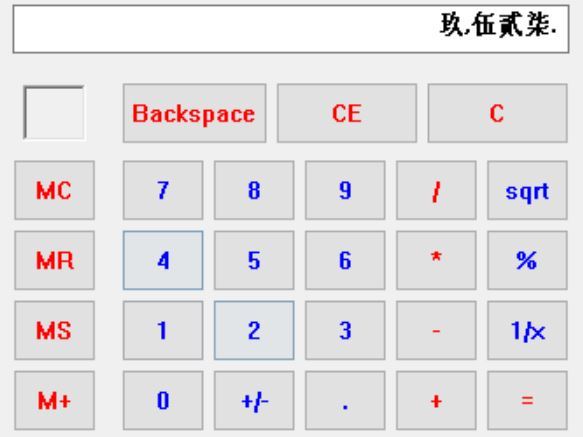
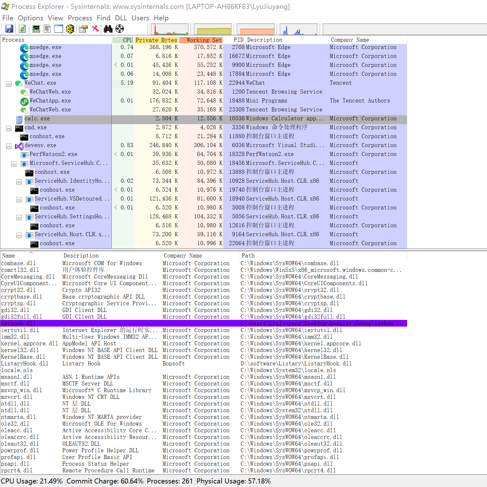
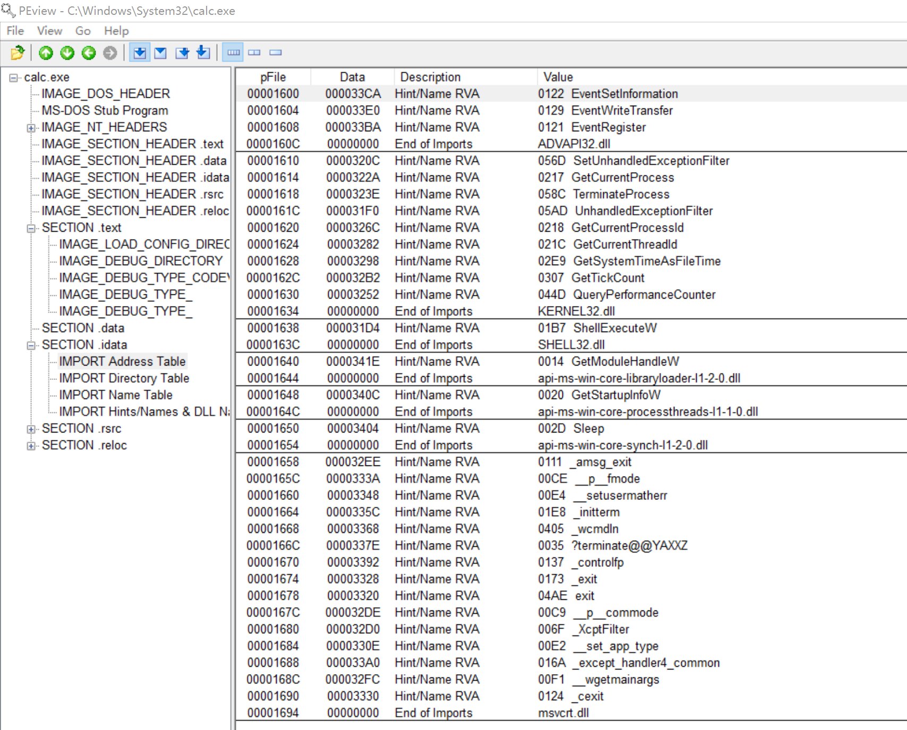
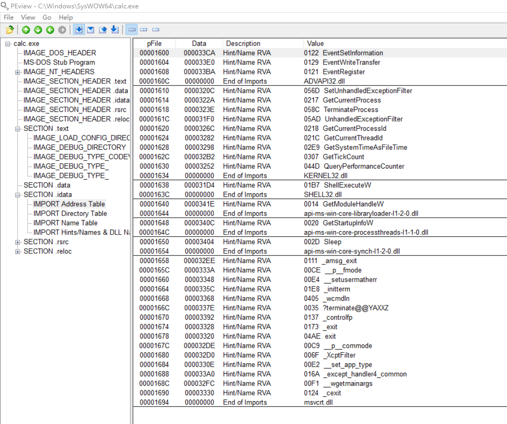

# 逆向工程与软件安全大作业实验报告

- [逆向工程与软件安全大作业实验报告](#逆向工程与软件安全大作业实验报告)
  - [1. 实验目的](#1-实验目的)
  - [2. 实验内容](#2-实验内容)
  - [3. 实验方法](#3-实验方法)
  - [4. 原理详述及实验流程](#4-原理详述及实验流程)
    - [4.1 选取目标API](#41-选取目标api)
    - [4.2 MySetWindowTextW()](#42-mysetwindowtextw)
    - [4.3 IATHook](#43-iathook)
    - [4.4 DllMain()](#44-dllmain)
    - [4.5 injectAllTheThings](#45-injectallthethings)
  - [5. 实验结果](#5-实验结果)
  - [6. 实验中遇到的问题](#6-实验中遇到的问题)
  - [7. 实验参考](#7-实验参考)

## 1. 实验目的

使用`Windbg`，综合应用 `Dll注入技术` 和 `IATHook` 更改特定API的功能。

注：由于windbg部分只涉及简单的下断点和调试工作，不是大作业的重点，故相关内容独立成 [winDbg实验报告](winDbg实验报告.md)。

## 2. 实验内容

向 `calc.exe` 进程注入dll文件，钩取IAT的 `user32.SetWindowTextW()` 函数的API地址，实现显示大写中文数字的计算器。

## 3. 实验方法

本次实验要求通过注入DLL文件来勾取某个API，DLL文件注入目标进程后，修改IAT来改变进程中调用的特定API的功能。

这种方法的优点是工作原理和实现较为简单，只需要在用户的DLL文件中重新定义API，再注入目标进程即可。但是相应的缺点是，如果要hook的API是动态加载的DLL文件，这种方法将无法实现。


## 4. 原理详述及实验流程

### 4.1 选取目标API

我们在之前的课程上使用WinDbg调试，已经了解到应该去hook哪个API，但是这里我们从初学者的角度出发，如何确定要勾取的API？这里我们使用PEView查看所有导入的API，并发现了几个可能相关的函数。



查阅[微软官方文档](https://docs.microsoft.com/en-us/windows/win32/api/winuser/)，确定我们最终要选取的 `SetWindowTextW` API。

```cpp
// Changes the text of the specified window's title bar (if it has one). If the specified window is a 
// control, the text of the control is changed. However, SetWindowText cannot change the text of a 
// control in another application.
BOOL SetWindowTextW(
   HWND    hWnd,
   LPCWSTR lpString
);
```

```cpp
// Sets the title or text of a control in a dialog box.
BOOL SetDlgItemTextW(
   HWND    hDlg,
   int     nIDDlgItem,
   LPCWSTR lpString
);
```

`SetWindowTextW()` 有两个参数。分别是窗口句柄和显示的字符串的指针。那么我们只要hook时查看字符串的内容，改成我们需要的就好了。

我们在之前的[WinDbg实验](winDbg实验报告.md)中，我们将数字2输入时更换成了3，证明hook该API是可行的。这个实验我们要求更换成大写中文数字，由于汉字字符编码在4E00-9FFF之间，而lpString缓冲区内每个数字也是两字节，所以我们只需要做简单的替换工作就好。

### 4.2 MySetWindowTextW()

```cpp
BOOL WINAPI MySetWindowTextW(HWND hWnd, LPWSTR lpString)
{
	wchar_t* pNum = L"零壹贰叁肆伍陆柒捌玖";
	wchar_t temp[2] = { 0, };
	int i = 0, nLen = 0, nIndex = 0;

	nLen = wcslen(lpString);
	for (i = 0; i < nLen; i++)
	{
		// 将阿拉伯数字转换为中文数字
		if (L'0' <= lpString[i] && lpString[i] <= L'9')
		{
			temp[0] = lpString[i];
			nIndex = _wtoi(temp);
			lpString[i] = pNum[nIndex];
		}
	}
	return ((PFSETWINDOWTEXTW)g_pOrginalFunction)(hWnd, lpString);
}
```

`MySetWindowTextW()` 函数更改了lpString中的内容，在最后调用函数指针 `g_pOrginalFunction`，它指向原来的 `SetWindowTextW()` 函数的起始地址，这样我们相当于调用原函数显示我们更改后的内容。

### 4.3 IATHook

首先我们回顾一下PE文件的结构。

```
Portable Executable
|--IMAGE_DOS_HEADER
|--MS-DOS Stub Program
|--IMAGE_NT_HEADERS
    |--Signature
    |--IMAGE_FILE_HEADER
    |--IMAGE_OPTIONAL_HEADER
|--IMAGE_SECTION_HEADER .text
|--IMAGE_SECTION_HEADER .data
|--IMAGE_SECTION_HEADER .rsrc
|--BOUND IMPORT Directory Table
|--BOUND IMPORT DLL Names
|--SECTION .text
    |--IMPORT Address Table
    |--IMAGE_DEBUG_DIRECTORY
    |--IMAGE_DEBUG_TYPE_CODEVIEW
    |--IMPORT Directory Table
    |--IMPORT Name Table
    |--IMPORT Hints/Names & DLL Names
|--SECTON .data
|--SECTION .rsrc
```

我们这里要找到 `IMAGE_IMPORT_DESCRIPTOR` 结构体数组（即IDT）在PE文件里，`IMAGE_OPTIONAL_HEADER32.DataDirectory[1].VirtualAddress` 存储着IDT的起始地址。


```cpp
// 该结构体的定义须在 Windows SDK 平台源码中寻找而非 Docs
typedef struct _IMAGE_IMPORT_DESCRIPTOR {
    union {
        DWORD   Characteristics;            // 0 for terminating null import descriptor
        DWORD   OriginalFirstThunk;         // RVA to original unbound IAT (PIMAGE_THUNK_DATA)
    };
    DWORD   TimeDateStamp;                  
    DWORD   ForwarderChain;                 // -1 if no forwarders
    DWORD   Name;
    DWORD   FirstThunk;                     // RVA to IAT (if bound this IAT has actual addresses)
} IMAGE_IMPORT_DESCRIPTOR;
```

我们以 `User32.dll` 为例。



也就是说我们找到了IDT就知道了哪些库的IAT的地址。
  
首先我们从ImageBase开始，经PE signature找到IDT第一个IID结构体的起始位置。
```cpp
    // ImageBase
    hMod = GetModuleHandle(NULL);  
    pAddr = (PBYTE)hMod;  
  
    // pAddr 为 PE signature 的虚拟地址，即IMAGE_NT_HEADER的首地址
    pAddr += *((DWORD*)&pAddr[0x3C]);  
  
    // dwRVA = RVA to IMAGE_IMPORT_DESCRIPTOR Table  
    dwRVA = *((DWORD*)&pAddr[0x80]);  
  
    // pImportDesc = VA to IMAGE_IMPORT_DESCRIPTOR Table  
    pImportDesc = (PIMAGE_IMPORT_DESCRIPTOR)((DWORD)hMod+dwRVA);  
```  
接下来我们通过循环比较出来 `user32.dll` 的 `IMAGE_IMPORT_DESCRIPTOR` 结构体地址。
```cpp
    for( ; pImportDesc->Name; pImportDesc++ )  
    {  
        // szLibName = VA to IMAGE_IMPORT_DESCRIPTOR.Name  
        szLibName = (LPCSTR)((DWORD)hMod + pImportDesc->Name);  
        if( !_stricmp(szLibName, szDllName) )  
        {  
            // pThunk = IMAGE_IMPORT_DESCRIPTOR.FirstThunk  
            //        = VA to IAT(Import Address Table)  
            pThunk = (PIMAGE_THUNK_DATA)((DWORD)hMod +   
                                         pImportDesc->FirstThunk);  
        //...
        }
    }
```
下一步是寻找 `SetWindowTextW()` 函数的地址，然后修改成我们自己的函数地址。IAT内存默认是只读的，我们用 `VirtualProtect()` 函数修改其属性。再修改函数的真正运行时地址 `IAT->Function` 值，最后把内存权限修改回去。这样在调用 `user32.SetWindowTextW()` 时其实调用的时我们自己的 `MySetWindowTextW()` 函数。
```cpp
    // pThunk->u1.Function = VA to API  
    for( ; pThunk->u1.Function; pThunk++ )  
    {  
        if( pThunk->u1.Function == (DWORD)pfnOrg )  
        {  
            // 更改为可读写模式  
            VirtualProtect((LPVOID)&pThunk->u1.Function,   
                            4,   
                            PAGE_EXECUTE_READWRITE,   
                            &dwOldProtect);  

            // 修改IAT的值  
            pThunk->u1.Function = (DWORD)pfnNew;     
            // 再复原IAT内存原来的访问权限            
            VirtualProtect((LPVOID)&pThunk->u1.Function,   
                            4,   
                            dwOldProtect,   
                            &dwOldProtect);                        
            return TRUE;  
        }  
    }  
```

### 4.4 DllMain()

前面的事情都完成后，Dllmain要做的事情就比较简单了。首先是获得目标API的原始地址，之后进行hook和unhook就可以了。

```cpp
    case DLL_PROCESS_ATTACH:
        g_porgFunc = GetProcAddress(GetModuleHandle(L"user32.dll"), "SetWindowTextW");
        //用hookiat.MySetWindowsText()钩取user32.SetWindowTextW()
        hook_iat("user32.dll", g_porgFunc, (PROC)MySetWindowTextW);
        break;
    case DLL_PROCESS_DETACH:
        //将calc.exe的IAT恢复原位
        hook_iat("user32.dll", (PROC)MySetWindowTextW, g_porgFunc);
        break;
    }
```

### 4.5 injectAllTheThings

这次试验使用之前上课用到的 [injectAllTheThings](https://github.com/fdiskyou/injectAllTheThings/) 中的 `CreateRemoteThread()` 技术。此部分是我对这部分代码的一些理解，不想看可以直接[跳过](#5-实验结果)。

我将整个注入过程分为以下四个步骤：

**4.5.1 获取目标进程句柄**

  ```cpp
    HANDLE hProcess = OpenProcess(
        PROCESS_ALL_ACCESS,
        FALSE, dwProcessId);
  ```
  调用 `OpenProcess` API，通过之前程序传递过来的 `dwProcessId` 获取目标进程的句柄，得到 `PROCESS_ALL_ACCESS` 权限，这样可以使用获取的句柄来控制对应的进程。

**4.5.2 将要注入的DLL的路径分配并写入目标进程内存**

  ```cpp
  // Calculate the number of bytes needed for the DLL's pathname
  DWORD dwSize = (lstrlenW(pszLibFile) + 1) * sizeof(wchar_t);
  // Allocate space in the remote process for the pathname
  LPVOID pszLibFileRemote = (PWSTR)VirtualAllocEx(hProcess, NULL, dwSize, MEM_COMMIT, PAGE_READWRITE);
  ```

  这部分代码的作用是将要加载的dll文件路径字符串告知目标进程。使用 `VirtualAllocEx()` 的目的是，因为内存空间无法直接进行写入操作，所以先使用 `VirtualAllocEx()` 在目标进程内存空间分配一块缓冲区，大小为dll路径字符串的长度。

  ```cpp
  // Copy the DLL's pathname to the remote process address space
  DWORD n = WriteProcessMemory(hProcess, pszLibFileRemote, (PVOID)pszLibFile, dwSize, NULL);
  ```
  之后使用 `WriteProcessMemory()` API 将其写入目标进程的内存空间。

**4.5.3 获取 `LoadLibraryW()` API的地址**
  
```cpp
// Get the real address of LoadLibraryW in Kernel32.dll
PTHREAD_START_ROUTINE pfnThreadRtn = (PTHREAD_START_ROUTINE)GetProcAddress(GetModuleHandle(TEXT("Kernel32")), "LoadLibraryW");
```

`LoadLibraryW()` 被用于向调用进程的地址空间加载指定模块。我们通过上述代码得到了 `kernel32.dll` 中  `GetProcAddress()` API的地址。同时，`kernel32.dll` 在每个进程中加载位置是相同的。

> 《Windows核心编程（第五版）》
> 
> 根据OS类型、语言、版本不同，kernel32.dll加载的地址也不同。并且Vista/7中应用了新的ASLR功能，每次启动时，系统DLL加载的地址都会改变。但是在系统运行期间它都会被映射到每个进程的相同地址。Windows操作系统中，DLL首次进入内存称为“加载”，以后其他进程需要使用相同DLL时不必再次加载，只要将加载过的DLL代码与资源映射一下即可，这种映射技术有利于提高内存的使用效率。

OS核心DLL会被加载到自身固有的地址，DLL注入利用的就是WindowsOS的
这一特性。所以，`kerne132.dll` 中的 `LoadLibraryW()` 地址与导入目标进程中的 `LoadLibraryW()` 地址是相同的。这样我们获得了目标进程中 `LoadLibraryW()` API 的地址。
  
**4.5.4 在目标进程中运行远程线程**

```cpp
// Create a remote thread that calls LoadLibraryW(DLLPathname)
HANDLE hThread = CreateRemoteThread(hProcess, NULL, 0, pfnThreadRtn, pszLibFileRemote, 0, NULL);
// pfnThreadRtn: LoadLibraryW()地址
// pszLibFileRemote: 要注入的dll路径字符串地址
```

接下来，原理上我们用 `LoadLibraryW()` 去调用注入的dll就好，但是Windows没有直接操作的函数。所以使用 `CreateRemoteThread()` API，官方文档给出了其[详细定义](https://docs.microsoft.com/en-us/windows/win32/api/processthreadsapi/nf-processthreadsapi-createremotethread)，主要功能是驱使目标进程调用 `LoadLibraryW()` 函数，进而加载指定的dll文件。


## 5. 实验结果

本次实验代码链接 [iathook](code/hookiat/) [injectAllTheThings.exe](code/dllInjection/)。

我们的操作步骤为：
- 分别编译通过两项目，生成 `injectAllTheThings.exe` 文件和 `iathook.dll` 文件；
- 在计算器 `calc.exe` 界面进行初始状态的展示；
- 在命令行中进行注入；
- 测试展示效果；
- 取消注入，测试是否还原。

命令：`injectAllTheThings.exe -t 1 calc.exe C:\Users\LyuJiuyang\Desktop\...\code\hookiat\Debug\iathook.dll`

（请注意填写为绝对路径）




（gif文件较大，时长约2分钟，若无法加载请使用VPN或进入[备用链接](https://gitee.com/lyulumos/Image-Hosting-Site/blob/master/iathook.gif)查看）


通过 `ProcessExplorer` 查看注入情况。发现成功注入。




## 6. 实验中遇到的问题

- Windows10 下的计算器无法使用本次实验所有方法，也无法使用Windbg调试。


  解决：可以看一下Win10计算器的IAT，会发现它调用了很多封装好的接口而不是导入函数，甚至IAT中都没有 `user32.dll` 。下面两张图分别是system32 和 sysWOW64 中的 `calc.exe` 的IAT分析。

  

  

  所以我下载了封装好的Windows XP上的计算器进行处理。


## 7. 实验参考

- [范大课程教学内容和视频](http://vlab.cuc.edu.cn/student/#/course/89)
- [李承远. 逆向工程核心原理. PE文件格式、DLL注入、API钩取部分](https://book.douban.com/subject/25866389/)
- [Jeffrey Richter, Christophe Nasarre. Windows核心编程(第5版). DLL注入部分](https://book.douban.com/subject/3235659/)
- [PE Format - Microsoft Docs](https://docs.microsoft.com/zh-cn/windows/win32/debug/pe-format)
- [fdiskyou/injectAllTheThings - GitHub](https://github.com/fdiskyou/injectAllTheThings/)
- [Windows API Hooking and DLL Injection - Security Zone](https://dzone.com/articles/windows-api-hooking-and-dll-injection)